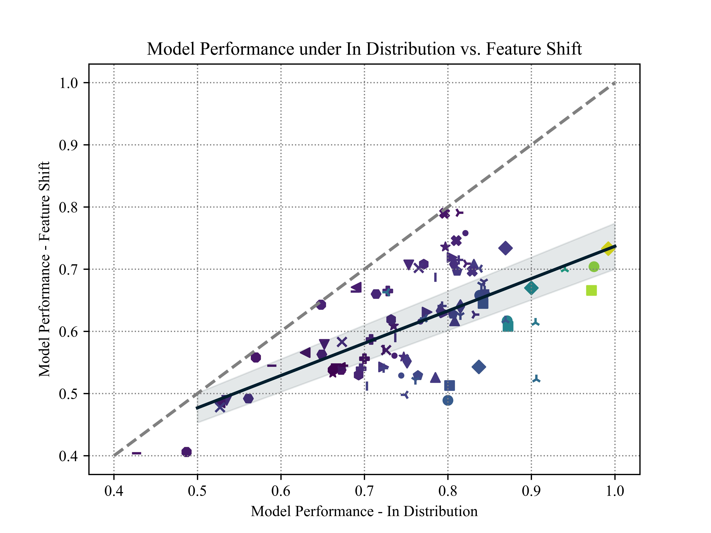

<div align="center">
    <h1>
        TabFSBench: Tabular Benchmark for Feature Shifts in Open Environment
    </h1>
</div>


---

## Introduction

**TabFSBench** is a benchmarking tool for feature shifts in tabular data in open-environment scenarios. It aims to analyse the robustness of a model in the face of feature shifts, i.e. how well the model performs when the number or meaning of features.

**TabFSBench** offers the following advantages:

- **Various Models**: Includes tree-based models, deep learning models and tabular LLMs.
- **Diverse Experiments**: Single-column missing, multi-columns(remove least/most relevance) and remove randomly.
- **Exportable Datasets**: Be able to export the feature-shift version of the given dataset.
- **Addable Components**: Supports to add new datasets and models, and export the given dataset under the specific experiment.

[//]: # (**If you use any content of this repo for your work, please cite the following bib entries:**)

[//]: # ()
[//]: # (```bibtex)

[//]: # (@article{ye2024closerlookdeeplearning,)

[//]: # (         title={A Closer Look at Deep Learning on Tabular Data}, )

[//]: # (         author={Han-Jia Ye and Si-Yang Liu and Hao-Run Cai and Qi-Le Zhou and De-Chuan Zhan},)

[//]: # (         journal={arXiv preprint arXiv:2407.00956},)

[//]: # (         year={2024})

[//]: # (})

[//]: # (```)

## Quickstart

### 1. Clone

Clone this GitHub repository:

```bash
git clone https://github.com/LAMDASZ-ML/TabFSBench
```

### 2. Environment setup

Create a new Python 3.10 environment and install 'requirements.txt'.

```bash
conda create --name yourEnvName python=3.10
pip install -r requirements.txt
```
### 3. Run
You need to input four parameters to use TabFSBench. There are dataset, model, task and degree.

**dataset** and **model**: input the full name. 

**task**: You can choose 'single', 'multi-removeleast', 'multi-removemost' or 'random' as TaskName.

**degree**: Degree refers to the number of missing columns as a percentage of the total number of columns in the dataset, in the range 0-1. If you want to see the performance of the model at all missing degrees, set Degree to 'all'.

**export_dataset**: Whether to export the dataset or not.
```bash
    python run_experiment.py --dataset DatasetName --model ModelName --task TaskName --degree Degree --export_dataset True/False
```

In **example.sh** you can get different kinds of instruction samples.

## Benchmark Datasets

All the datasets used in TabFSBench are publicly available. You can get them from [OpenML](https://www.openml.org/) or [Kaggle](https://www.kaggle.com/). Also you can directly use them from `./datasets`.

### 📂How to Place Datasets

Datasets used in TabFSBench are placed in the project's current directory, corresponding to the file name.

Each dataset folder consists of:

- `dataset.csv`, which must be included.

- `info.json`, which must include the following two contents (task can be "regression", "multiclass" or "binary", link can be from Kaggle or OpenML):
  

  ```json
  {
    "task": "binary", 
    "link": "www.kaggle.com"
  }
  ```


## Models

TabFSBench is possible to test three kinds of models' performance directly, including tree-based models, deep learning models and tabular LLMs. For LLMs, TabFSBnech provides text files(.json) about the given dataset that can be used directly for LLM to finetune.

#### Tree-based models
1. **[CatBoost](https://catboost.ai/)**: A powerful boosting-based model designed for efficient handling of categorical features.
2. **[LightGBM](https://lightgbm.readthedocs.io/en/latest/index.html)**: A machine-learning model based on the Boosting algorithm.
3. **[XGBoost](https://xgboost.readthedocs.io/en/latest/index.html)**: A machine-learning model incrementally building multiple decision trees by optimizing the loss function.

#### Deep learning models
You can their details from their papers or **[LAMDA-TALENT](https://github.com/qile2000/LAMDA-TALENT/tree/main)**
1. **MLP**: A multi-layer neural network, which is implemented according to [RTDL](https://arxiv.org/abs/2106.11959).
2. **ResNet**: A DNN that uses skip connections across many layers, which is implemented according to [RTDL](https://arxiv.org/abs/2106.11959).
3. **[SNN](https://arxiv.org/abs/1706.02515)**: An MLP-like architecture utilizing the SELU activation, which facilitates the training of deeper neural networks.
4. **[DANets](https://arxiv.org/abs/2112.02962)**: A neural network designed to enhance tabular data processing by grouping correlated features and reducing computational complexity.
5. **[TabCaps](https://openreview.net/pdf?id=OgbtSLESnI)**: A capsule network that encapsulates all feature values of a record into vectorial features.
6. **[DCNv2](https://arxiv.org/abs/2008.13535)**: Consists of an MLP-like module combined with a feature crossing module, which includes both linear layers and multiplications.
7. **[NODE](https://arxiv.org/abs/1909.06312)**: A tree-mimic method that generalizes oblivious decision trees, combining gradient-based optimization with hierarchical representation learning.
8. **[GrowNet](https://arxiv.org/abs/2002.07971)**: A gradient boosting framework that uses shallow neural networks as weak learners.
9. **[TabNet](https://arxiv.org/abs/1908.07442)**: A tree-mimic method using sequential attention for feature selection, offering interpretability and self-supervised learning capabilities.
10. **[TabR](https://arxiv.org/abs/2307.14338)**: A deep learning model that integrates a KNN component to enhance tabular data predictions through an efficient attention-like mechanism.
11. **[ModernNCA](https://arxiv.org/abs/2407.03257)**: A deep tabular model inspired by traditional Neighbor Component Analysis, which makes predictions based on the relationships with neighbors in a learned embedding space.
12. **[AutoInt](https://arxiv.org/abs/1810.11921)**: A token-based method that uses a multi-head self-attentive neural network to automatically learn high-order feature interactions.
13. **[Saint](https://arxiv.org/abs/2106.01342)**: A token-based method that leverages row and column attention mechanisms for tabular data.
14. **[TabTransformer](https://arxiv.org/abs/2012.06678)**: A token-based method that enhances tabular data modeling by transforming categorical features into contextual embeddings.
15. **[FT-Transformer](https://arxiv.org/abs/2106.11959)**: A token-based method which transforms features to embeddings and applies a series of attention-based transformations to the embeddings.
16. **[TANGOS](https://openreview.net/pdf?id=n6H86gW8u0d)**: A regularization-based method for tabular data that uses gradient attributions to encourage neuron specialization and orthogonalization.
17. **[SwitchTab](https://arxiv.org/abs/2401.02013)**: A self-supervised method tailored for tabular data that improves representation learning through an asymmetric encoder-decoder framework. Following the original paper, our toolkit uses a supervised learning form, optimizing both reconstruction and supervised loss in each epoch.
18. **[TabPFN](https://arxiv.org/abs/2207.01848)**: A general model which involves the use of pre-trained deep neural networks that can be directly applied to any tabular task.

#### Tabular LLMs
1. **[TabLLM](https://arxiv.org/abs/2210.10723)**: A framework that leverages LLMs for efficient tabular data classification.
2. **[UniPredict](https://arxiv.org/abs/2310.03266)**: A framework that firstly trains on multiple datasets to acquire a rich repository of prior knowledge. UniPredict-Light model that TabFSBench used is available at [Google Drive](https://drive.google.com/file/d/1ABsv0C9HSJ9-M3kpkGRIFEw-4ebKdA3h/view?usp=sharing).

### How to Add New Models

TabFSBench provides two methods to evaluate new model on feature-shift experiments.

1. Export the dataset. Set export_dataset as True, then can get a csv file of a given dataset in a specific experiment.
2. Import model python file.
   - Add the model in `./model`.
   - Add the method name in the `./model/utils.py`.
   - Add the parameter settings for the new method in `./configs/[MODEL_NAME].json`

## Experimental Results
